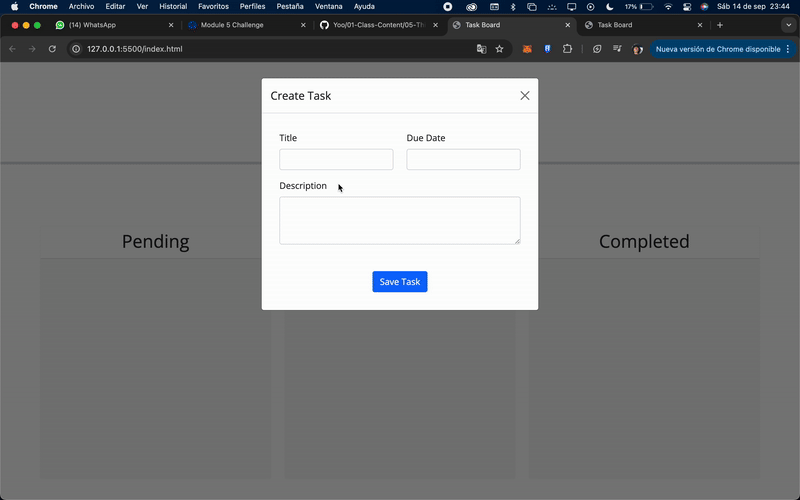

# Third-Party APIs Challenge: Task Board

## Description

Create a simple task board application that allows a team to manage project tasks by modifying starter code. This app will run in the browser and feature dynamically updated HTML and CSS powered by jQuery. The Day.js library will be used to handle dates, and tasks will be saved and managed using localStorage.

## User Story

AS A project team member with multiple tasks to organize,  
I WANT a task board  
SO THAT I can add individual project tasks, manage their state of progress, and track overall project progress accordingly.

# Technologies Used

- **jQuery**: For dynamically updating HTML and CSS.
- **Day.js**: For working with dates.
- **localStorage**: For saving and managing tasks.

## Setup Instructions

1. Clone the starter code:

   ```bash
   git clone <URL to starter code>

   ```

2. Open index.html in a web browser.

## Visual reference of project

The following image demonstrates the app's appearance:



## License

This project uses the MIT license.
